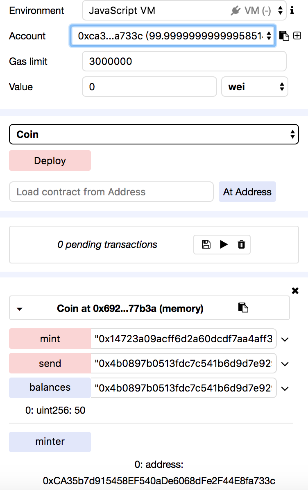

## 运行Coin合约

* 编译器（<https://ethereum.github.io/browser-solidity/>）编译

* deploy创建合约

* 在mint输入：

```
"0x14723a09acff6d2a60dcdf7aa4aff308fddc160c",100
```

表示创建者在账户"0x14723a09acff6d2a60dcdf7aa4aff308fddc160c"添加100

* 在send输入：

```
"0x4b0897b0513fdc7c541b6d9d7e929c4e5364d2db",50
```

表示由当前账户向"0x4b0897b0513fdc7c541b6d9d7e929c4e5364d2db"转账50

* 在balances输入账户地址:

```
"0x4b0897b0513fdc7c541b6d9d7e929c4e5364d2db"
```

点击后显示地址"0x4b0897b0513fdc7c541b6d9d7e929c4e5364d2db"的账户余额




